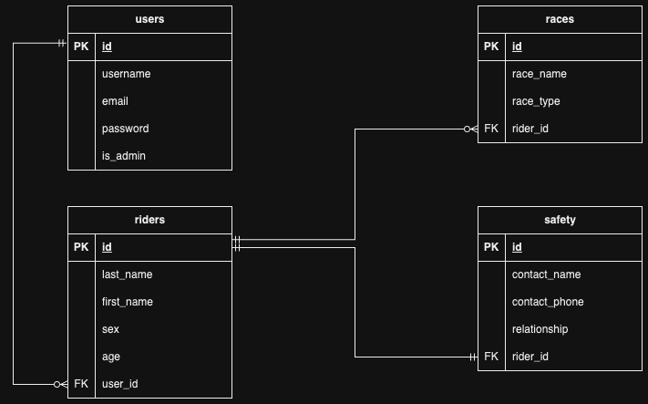

# Mountain Bike API

## R1 and R2

The idea behind my app is to create an easy way for people to enter into a mountain biking competition. Outside of large sponsored events, many local club races don’t utilise a database management system and simply rely upon someone manually entering data into a spreadsheet. This is not an effective way of collecting and managing data, therefore I wanted to present a possible solution via an API. The scope on a project like this could be used on the small-scale, where each club could have their own self-managed database or even scaled larger and integrated with AusCycling (the national sporting organisation for all Australian cycling events) to effectively “link” several clubs together, sorted by region or state for example. This could help out small regional clubs who may not have an established event management team of their own. If this API were to be coupled with a user-friendly front-end it could provide an easy way to create, store and modify rider data for bike clubs. Having a dedicated portal that securely collects and holds rider data would also make it easier for event managers to keep track of the entrants in a competition, which races they enter in as well as their emergency contact information in case of an accident. 

This data could be presented in an app where authorised team members have *read* access for this purpose. As for modifying data, a future app feature could allow users (who have generated an account) to update their details and request admin to remove them for example, deletion of account data or pulling a rider out of a race etc. Only the dedicated admin would be able to delete data from the database in order to preserve the integrity of the information held. 

The data typically gathered in a mountain bike race includes personal information such as name, age, sex, contact details (of the user/rider as well as a nominated emergency contact) alongside things like skill level and team details (if any). The inclusion of personal data means that there is a responsibility to keep that data safe, which is another reason to create an alternative to using spreadsheets. When it comes to data security, several questions must be raised:

*In how many places will the data be stored and are there any backups?*
(Is the data stored locally on one device or many? Is it backed up to a hard-drive or cloud service?)

*Is the data being stored securely?*
(How many levels of security are protecting access to the data? What type of security is being used?)

*How many people have access to the data?*
(Who are the authorised people that have access and can modify the data?)

In this app specifically, techniques such as password hashing (for user accounts) using Bcrypt, session tokens with JWT and setting a dedicated system admin will be employed to help establish security for the database. With further updates and the inclusion of front-end, establishing some sort of cloud-back up could be a good idea in case the database gets compromised or corrupt.

The overall structure of this app is comprised of four tables:
A ‘users’ table which represents the user who is creating an account and interacting with the API.
A ‘riders’ table which houses the personal data of each rider (name, sex, age)
A ‘races’ table which contains the race name and type
A ‘safety’ table which holds the rider’s emergency contact name, phone number and relationship to rider.
Users will be able to create an account, add the details for a rider, their emergency contact details and enter races directly. Hypothetical future additions to the app could include an ecommerce payment system for race entry fees and even merchandise that can be purchased ahead of the event which would include an inventory system. In conclusion, the overall aim of this app is to create an easy to use and manage organisational tool for mountain bike event management.

## R3
Due to the nature of this project, a relational database is ideal for housing the required information. A relational database allows us to organise and store important information in rows and columns, which form tables. Each table has a ‘primary key’ which identifies the rows of data within a table, eg ‘staff_ids’ could be the primary key for a table of staff members. Two or more tables form what is called a *schema* and they are connected via foreign keys. A foreign key establishes dependencies between tables for example, the connection between the users table and riders table is connected by the foreign key **rider_id**. To show the overall layout of a database schema as well as the relationships between the tables, an Entity Relationship Diagram (ERD) is part of the planning of a relational database. It allows you to see a ‘blueprint’ of which tables form the database, the collections of data as well as how the tables relate to one another using notation like Chen or Crow’s Foot (what we’re using) which use lines and symbols to notate the relationships.

The database system used in this project is PostgreSQL. It is an incredibly popular relational database management system (DBMS), open-source and very versatile. 

Some of the benefits to using PostgreSQL include:

**Robust feature set**

PostgreSQL has a large list of features relating to performance, configuration, security and programming extensions that help it stand out from competitors. It has support for database functions written in many different programming languages like Python, Java, JavaScript and Perl and is fully ACID compliant (since 2001 according to the Postgres documentation). ACID (Atomicity, Consistency, Isolation and Durability) are four critical properties of relational databases that refer to the guarantees that database transactions must support to avoid errors and maintain data integrity.

PostgreSQL also supports a large number of data types such as network addresses (CIDR, subnet masks, MAC for both IPv4 and IPv6), geometric data types (to define both two and three-dimensional shapes like circles, boxes and polygons) and even allows for code comments which is very handy during development.

**Object-oriented features**

A big point of difference between PostgreSQL and other relational databases such as MySQL is that Postgres is an Object-relational database management system. This means alongside being able to handle relational database functions, it also allows for definition of custom data types, overload functions and inheritance relationships between tables. This makes it a perfect choice for applications written in object-oriented programming languages such as Python, Java, Ruby and PHP among others. This project is using the Python language with ORM support from SQLAlchemy and Marshmallow to assist in converting objects between Python and PostrgreSQL.

**SQL conformance**

SQL standards exist to define minimum functionality and inter-operability requirements for SQL implementations (Prisma 2023). Another area where PostgreSQL stands out from its competitors is its conformance to 160 out of 179 core requirements as set out by SQL:2016 (The eighth revision of the ISO(1987) and ANSI(1986) standard for SQL database query language).

**Open-source and free**

Another big plus for using PostgreSQL is that it is completely free and open-source to use however you wish. It is an open-source project managed by a development community managed by The PostgreSQL Global Development Group. It has had community-driven development for decades and a large amount of extensions and applications are available to enhance the functionality of the PostgreSQL software. It is a powerful tool used by individuals all the way to huge global corporations like Apple, Instagram and even NASA to handle relational databases. (NASA uses PostgreSQL to store orbit data from the Space Station!)

PostgreSQL’s advantages outweigh the disadvantages. The two main drawbacks to using PostgreSQL include lack of ownership and sometimes slower performance when compared to other database management systems. One downside to being open-source is that PostgreSQL is not owned by one particular organisation, therefore it has no “warranty”, liability or indemnity protection if things go wrong. Because it is managed and worked on by a large community of developers, compatibility issues can occur for some users which may require additional software or hardware to run an open-sourced program. There can also be challenges to performance particularly when it comes to read speed as well as data recovery when compared to other systems such as MySQL.

Thanks to its capability with objects, PostgreSQL works perfectly with Python with a little help from ORM and connector libraries SQLAlchemy, Marshmallow and psycopg2. These packages will allow us to use native Python language to perform operations such as create, seed and drop (delete) tables in our PostgreSQL database.

## R4
Object Relational Mapping (ORM) is a programming technique used to create a bridge between object-oriented programs and relational databases. It uses metadata (*data that gives information about other data*) descriptors to create a virtual layer between a programming language and the database, simplifying the interaction for the developer. ORM makes it possible to access and manipulate objects without having to necessarily worry about how they relate to their data sources. This is incredibly useful when it comes to using a relational database because it can allow developers to perform CRUD (Create, Read, Update, Delete) operations without needing to directly use SQL (Structured Query Language). ORM creates a logical model of the program without specifying underlying code details which helps developers understand the structure of the database. When changes are made to a data object, the relational database will respond to these changes (eg. Create, insert, update, delete). This occurs because the ORM converts the data between tables and generates the SQL code required to respond to application changes. You could think of an ORM to be a “middle-man” who takes care of the transaction between the application and the relational database. The developer doesn’t necessarily need to know the exact lingo to make the interaction happen because the ORM takes care of it for them.

Object Relational *Mappers* are software tools that perform the task of ORM and there are many different types for various languages and applications. There are several benefits to using ORM tools such as:

- It can help speed up development time (and potentially decrease the costs of development) because it can take care of SQL interaction for the most part between the programming language and the relational database, eliminating repetitive SQL code.
- Improves security because ORM tools are built to remove the possibility of SQL injection attacks. An SQL injection is a technique used to gain access to data-driven applications by inserting malicious SQL code statements into an entry field for execution. (Ie. trying to gain access to personal data on a database)
- An ORM can be created to write vendor-specific SQL code for dedicated projects which can streamline development process.

In contrast, a couple of notable downsides to using ORM tools is that they can be limited when it comes to very complex queries, can be slower in performance to using actual SQL code directly and because there are so many different ORM tools out there it can also be time-consuming learning them and their nuances. For this project specifically, SQLAlchemy will be used as the ORM between the Python programming language and the PostgreSQL database. It allows us to access and run SQL queries in the database using Python language instead of SQL directly. *Marshmallow* is an ORM library which will be used in conjunction with SQLAlchemy to help convert complex data types (objects) to and from native Python data types. It will map the database schema to our Python objects. 

An example of this can be seen below where SQLAlchemy’s table function is used to generate a “user” table:

Another example on the same file shows the Marshmallow schema for the ‘riders’ table:

## R5

The following are two examples of POST requests that are generated when a user creates their account and one where they log in.

## R6

Due to time and personal skill constraints with this project I needed to simplify my entity relationship diagram. Initially I wanted to have another table representing ‘race_levels’ as a way of matching a ‘rider_skill’ foreign key to a main ‘race_levels’ id. This would be another logical inclusion to this database as it is something a lot of race events would use. Typically at recreational club level, men and women compete together in the event however, another feature would be to sort rider sex so women’s race results would be separate to the men’s purely for timing and category purposes. My design is very basic but shows four main tables that would be included in any race database; user, rider, races, safety (emergency contacts).

## R7

Psycopg2, JWT and Bcrypt are third-party applications that will be used in this project. They all work with Python and PostgreSQL and will be installed via pip. The full requirements for this project can be found in the ‘requirements.txt’ file for reference. All of these third party apps will be initialised in the init.py file and referenced throughout the code files.

**psycopg2**

Psycopg2 is a connector library that allows us to connect our PostgreSQL database to our Python script. It is the most popular PostgreSQL adapter (also referred to as a driver) for the Python programming language. It is “wrapper” around the C programming language interface for PostgreSQL, libpq. An example of what it can do is automatically convert the result of an PostgreSQL array data type to a Python list. 

**JWT**

JSON (JavaScript Object Notation) is a lightweight data interchange format that is easy for people to read and write and easy for machines to parse and generate. It is a subset of the JavaScript programming language. JSON Web Token (JWT) is a compact and self-contained way to securely transmit information between parties as a JSON object. The information being transferred can be verified and trusted because it has a digital signature. Signed tokens will be used in this project to generate a login session token that will allow the user to login securely, for added security this token will expire after a specified time period. 

## R8 and R9

The **users** table represents the information collected from a user who creates an account through the application. It contains the attributes **username**, **email**, **password** and **is_admin** (which shows with a boolean value if the particular user is or is not an admin). This table is directly linked to the *riders* table in a one(and only one) to zero-to-many relationship because there *needs* to be one user, but *zero* or *more* riders can be added by that user to the account (eg. family members). Riders can can only be added to the database by *one* user_id, which is the foreign key linking the two tables.

The **riders** table contains the identifying data for each rider entered in the event. **last_name**, **first_name**, **sex** and **age** are collected here for the purpose of identification as well as being able to sort by sex (potential integration with other tables for creating different categories) as well as rider age (again for creating age groups). This table is linked via user_id foreign key to the id of users table. Each rider needs to have one ‘safety contact’, so this table is joined to the **safety** table via one-and-only one relationship, rider_id. 

The **safety** table contains the **contact_name**, **contact_phone** and *relationship** (relationship to rider ie, parent or partner) attributes. It is joined to the *riders* table by a one-and-only one relationship through the safety table’s ‘rider_id’ foreign key. There can only be one safety contact per rider.

The **races** table contains the attributes **race_name** and *race_type* which specify the name of the race as well as what general type it is, for example ‘downhill’ or ‘enduro’. It is connected to the **riders** table by a one-and-only one to a zero-to-many relationship as one rider can enter in zero or many races but those races can only be linked to that one rider_id who is entering (on that account). 

## R10

In order to keep organised, both a Trello board and to-do checklist were used during the planning and execution of this project. I favour the to-do list stored locally on my machine because it’s easy for me to access not only on my computer but also on my phone (through the cloud) so if I remember something, it is easy for me to quickly add to/update the list. Because of this I sometimes forget to update the Trello board when I actually complete a task so I have included both the link to the board as well as screenshots from my to-do list to show what I’ve been working with. A lot of plates were being juggled this term in study/life/work which has been a massive challenge and caused me to not always have a consistent amount of time to work on some features. I have done my best to include as much detail as possible in this documentation as well as code comments explaining what I’ve done and why. 

[Trello board](https://trello.com/b/SlOmm3d3/api-webserver)

**REFERENCES**

[Oracle - RDBMS](https://www.oracle.com/au/database/what-is-a-relational-database/)

[PostgreSQL official documentation](https://www.postgresql.org/about/)

[LearnSQL - Postgres](https://learnsql.com/blog/companies-that-use-postgresql-in-business/)

[Prisma.io - Postgres](https://www.prisma.io/dataguide/postgresql/benefits-of-postgresql)

[The Server Side - ORM](https://www.theserverside.com/definition/object-relational-mapping-ORM)

[Datacamp - SQLAlchemy](https://www.datacamp.com/tutorial/sqlalchemy-tutorial-examples)

[JWT.io](https://jwt.io/introduction)

[NordVPN - Bcrypt](https://nordvpn.com/blog/what-is-bcrypt)
